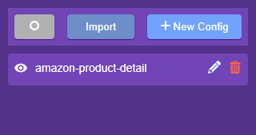
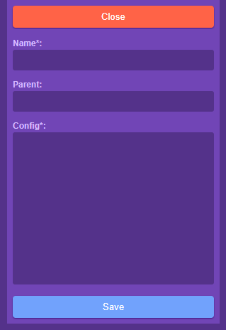
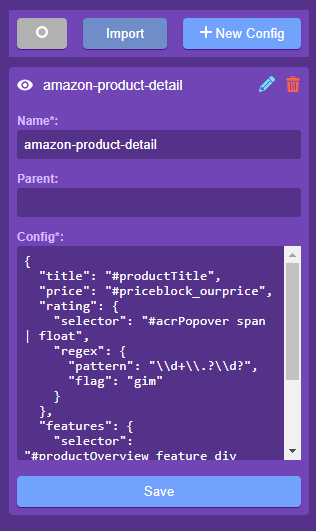
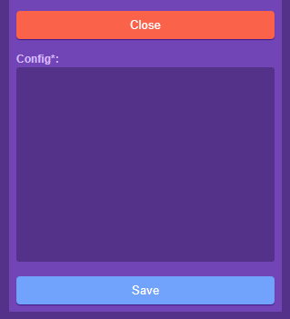

# muninn-extension

It serves to visualize the [muninn](https://github.com/aykutkardas/muninn) configs you have prepared.

## Screen Shots

### Config List

### New Config

### Edit Config

### Import Configs

